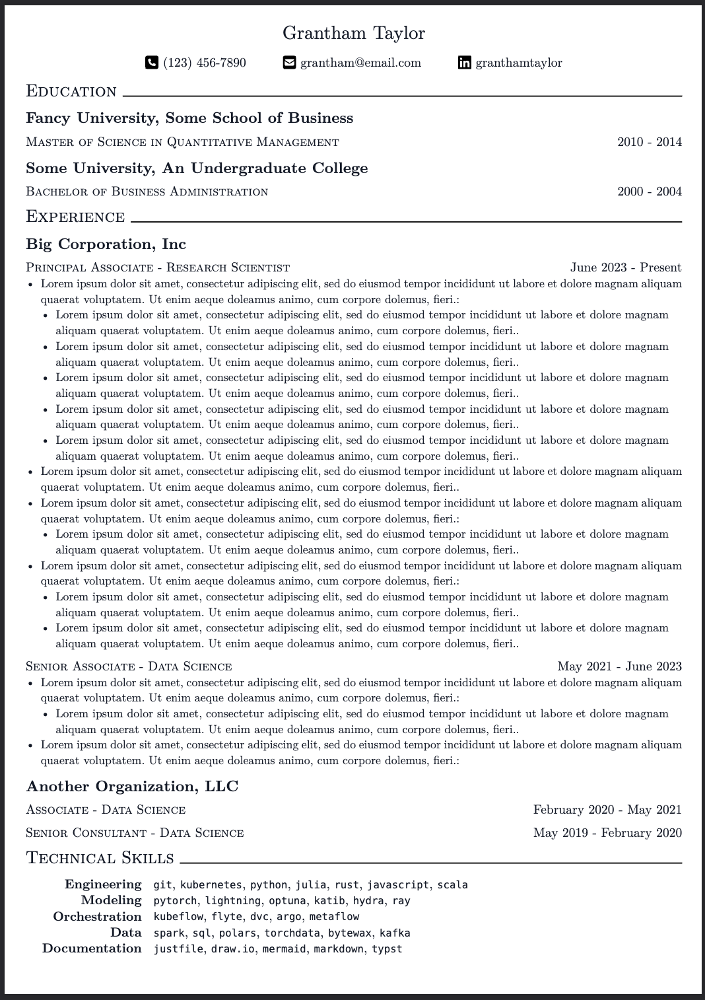

# Another Typst Resume Template!

Plenty of issues, but it works well for me.

1. Install Typst (`brew install typst`).
2. Install Justfile (`brew install justfile`).
3. Create a file called `resume.typ` that looks like `sample-resume.typ`
4. Run `just dev` to start hot-reloading

Alternatively, check out the `typst` extension for VS Code.

Pull requests are welcome.

